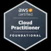

---
##### MY CERTIFICATIONS:-

---
<!--
**kevinndungu-source/kevinndungu-source** is a ✨ _special_ ✨ repository because its `README.md` (this file) appears on your GitHub profile.

Here are some ideas to get you started:

- 🌱 I’m currently implementing Infrastructure as Code (IaC) applications.
- 👯 I’m looking to collaborate on the AWS cloud architecture of robust Data Pipelines.
- 💬 Ask me about Machine Learning and automation.
- 😄 Pronouns: He/Him.
- ⚡ Fun fact: I love tinkering with networking structures i.e. home lab servers.

-->
