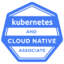
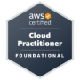
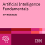

---

  ### Welcome to my GitHub Portfolio

  Here, you'll find a dynamic collection of **data-driven projects** showcasing my expertise in:

- **Cloud Data Engineering**: Architecting scalable, secure, and optimized data pipelines on cloud platforms.
- **FinTech Solutions**: Leveraging data engineering to power fintech with seamless, secure transactions.
- **Analytics Engineering**: Unlocking insights with advanced analytics using **SQL**, **Python** and top industry tools.
- **Cutting-Edge Technology**: Using cutting-edge cloud and big data tools to build resilient infrastructures.

  Explore my projects and see how I use data to deliver impactful solutions!

---
##### My tools for programming, data manipulation, storage & visualization:-

| Python3 | Conda | Jupyter | Spark | SQLserver | Postgres | MySQL |
|----------|----------|----------|----------|----------|----------|----------|
|  |  |  |  |  |  |  |  |

---
##### Tools for working with frameworks and main libraries for Python3 | Version control, Environment & Testing:-

| Numpy | Pandas | Scikitlearn | Git | GitHub | Docker | Postman |
|----------|----------|----------|----------|----------|----------|----------|
|  |  |  |  |  |  |  |

---

##### Certifications:-

---
<!--
**kevinndungu-source/kevinndungu-source** is a ✨ _special_ ✨ repository because its `README.md` (this file) appears on your GitHub profile.

Here are some ideas to get you started:

- 🌱 I’m currently implementing Infrastructure as Code (IaC) applications.
- 👯 I’m looking to collaborate on the AWS cloud architecture of robust Data Pipelines.
- 💬 Ask me about Machine Learning and automation.
- 😄 Pronouns: He/Him.
- ⚡ Fun fact: I love tinkering with networking structures i.e. home lab servers.

-->
